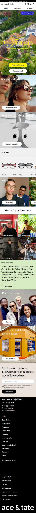
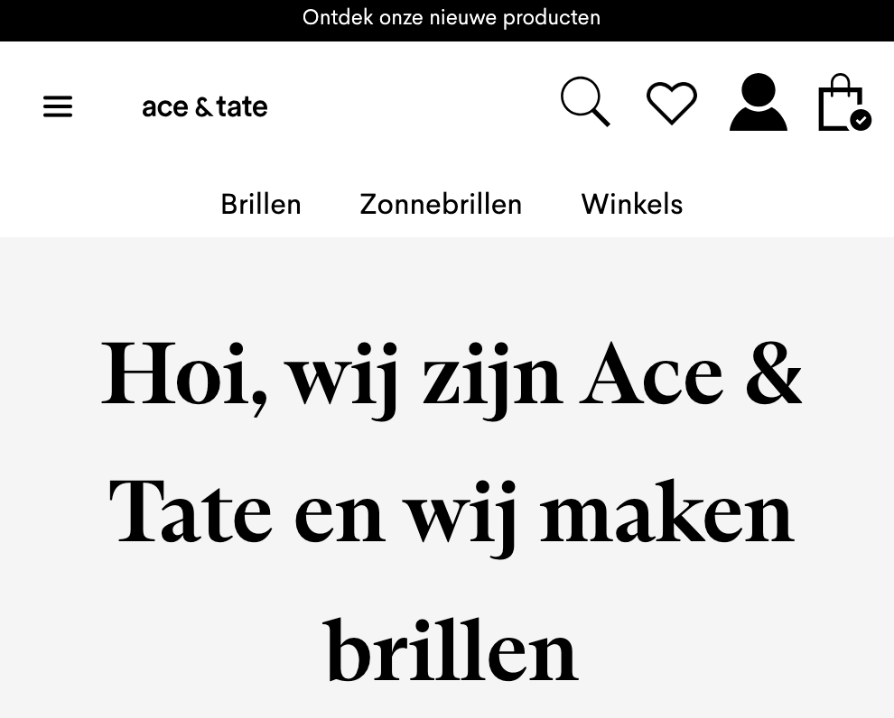
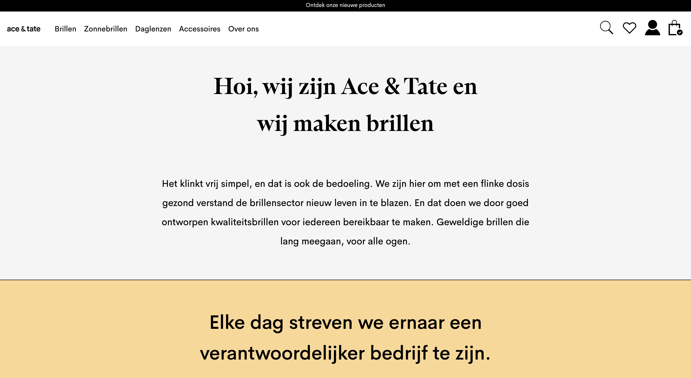
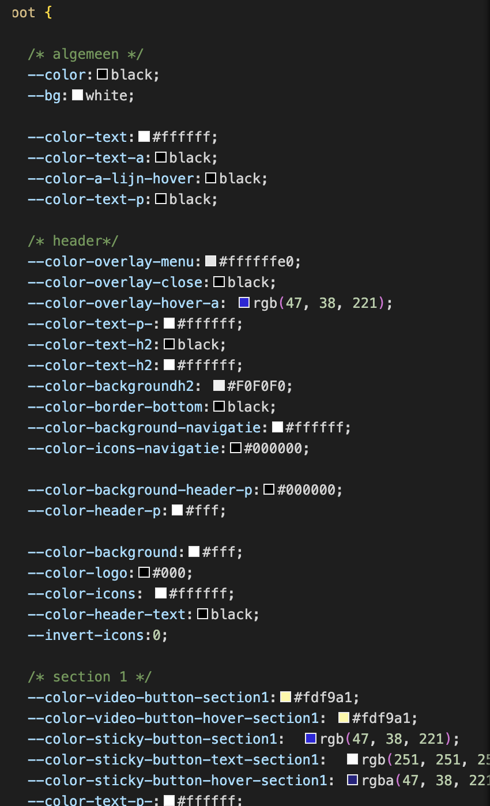
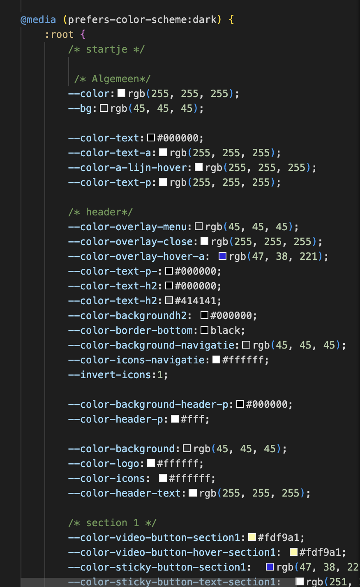

# Procesverslag
Markdown is een simpele manier om HTML te schrijven.  
Markdown cheat cheet: [Hulp bij het schrijven van Markdown](https://github.com/adam-p/markdown-here/wiki/Markdown-Cheatsheet).

Nb. De standaardstructuur en de spartaanse opmaak van de README.md zijn helemaal prima. Het gaat om de inhoud van je procesverslag. Besteedt de tijd voor pracht en praal aan je website.

Nb. Door *open* toe te voegen aan een *details* element kun je deze standaard open zetten. Fijn om dat steeds voor de relevante stuk(ken) te doen.

## Jij

  
uitwerken voor kick-off werkgroep

  ### Auteur:
Geneva Gemerts

  #### Je startniveau:
  Blauw

  #### Je focus:
  Responsive
 

## Je website

  
Ace & Tate

  ### Je opdracht:
 (https://www.aceandtate.com/nl)

  #### Screenshot(s) van de eerste pagina (small screen): 
  Home pagina
  

  #### Screenshot(s) van de tweede pagina (small screen):
Over ons pagina

## Toegankelijkheidstest 1/2 (week 1)

  
uitwerken na test in 2e werkgroep

  ### Bevindingen
  Lijst met je bevindingen die in de test naar voren kwamen:

## Breakdownschets (week 1)

  
uitwerken na afloop 3e werkgroep

  ### wellicht nog een dynamisch deel (bijv filter): 
  

## Voortgang 1 (week 2)

  
uitwerken voor 1e voortgang

  ### Stand van zaken
  hier dit ging goed & dit was lastig (neem ook screenshots op van delen van je website en code)

  ### Agenda voor meeting

- Hoe maak je via je cursor een custom afbeelding
- Hoe laat ik alle items zien in mijn drop down menu
- Is de navigatie goed opgebouwd?
- Hoe Krijg ik een drop down menu als je over de tekst hovert in de navigatie,\

  ### Verslag van meeting
 Mijn html structuur klopte niet helemaal. En ik moest goed opletten op typfouten van tags of dat ik dingen niet netjes afsloot.
- ...

## Voortgang 2 (week 3)

  
uitwerken voor 2e voortgang

  ### Stand van zaken

  ### Agenda voor meeting
  samen met je groepje opstellen

- Vraag over de navigatie die verspringt
  - Tabellen, sommige hebben een extra kolom nodig.
  - Hoe maak ik een carrousel?
  - Hoe geef je een iframe vormgeving
  - Hoe werkt het met een navigatiebar die responsive is die een deel wel laat zien en een ander deel verwerkt in de hamburger menu

  ### Verslag van meeting
   Ik heb geleerd dat je meerdere navigaties in de html mag maken. In mijn geval 3.
  Voor elk stukje heb je een afmeting en dit doe je door middel van media queries 

  

## Toegankelijkheidstest 2/2 (week 4)

  
uitwerken na test in 9e werkgroep

  ### Bevindingen
  Lijst met je bevindingen die in de test naar voren kwamen (geef ook aan wat er verbeterd is): Tijdens het onderzoek naar de toegankelijkheid van de website van Ace & Tate ontdekte ik dat er enkele belangrijke verbeterpunten zijn om te voldoen aan de webtoegankelijkheidsnormen (zoals WCAG). Hoewel de basisfunctionaliteit over het algemeen werkt, zijn er obstakels voor gebruikers met beperkingen. Zo ontbreken er bijvoorbeeld beschrijvende alt-teksten bij sommige afbeeldingen, waardoor gebruikers die screenreaders gebruiken moeite hebben om de inhoud te begrijpen. Ook was het besturen met de screenreader niet heel duidelijk.

## Voortgang 3 (week 4)

  
uitwerken voor 3e voortgang

  ### Stand van zaken

  ### Agenda voor meeting

- Vragen over hoe ik over een link hover en er een afbeelding te voorschijnkomt.
- Vragen over de footer, hoe deel ik deze in voor desktop?
- Grid gebruiken voor de bestsellers section? 

  

  ### Verslag van meeting
  
- Uittekenen van een grid helpt bij het proces van waar plaats ik ergens. 
 

 ### Laatste meeting

 

## Eindgesprek (week 5)

  
uitwerken voor eindgesprek

  ### Je uitkomst - karakteristiek screenshots:

  ### Dit ging goed/Heb ik geleerd: 
  Korte omschrijving met plaatjes

  

  ### Dit was lastig/Is niet gelukt:

Het is mij niet gelukt om de hamburger menu naast het logo te plaatsen.

 ### Laatste eindgesprek

 Het vak frontend vond ik een pittig vak. Ik wilde heel graag het vak halen. Hierdoor heb ik er veel tijd aan besteed. Ik begreep dingen niet altijd even goed, doordat  ik eigenlijk "teveel code" schreef. Ik wist niet helemaal waar het fout ging als iets niet werkte. Ik heb bijvoorbeeld van de docent geleerd hoe ik doormiddel van inspecteren kan zien in de browser of iets overbodige regels zijn en hoe ik kan kijken hoe ik mijn code kan opschonen. Ik had zoveel dubbele regels of overbodige elementen in mijn css staan. Waardoor sommige elementen dan gewoon niet werkte. 

  Verder heb ik aanpassingen gedaan aan het menu wat mij eerst niet gelukt was.

  

   
  

  

  

   

 Ik merkte dat ik bepaalde dingen met flexbox wilde oplosssen maar dit eigenlijk veel beter met een grid kon doen. Hierdoor ging ik tekst over afbeeldingen overlappen doormiddel van padding margin. Hierdoor was dit niet handig en responsive. Ik had voor ieder formaat een afbeelding met flexbox en dan de tekst erover heen met een hele grote margin en padding. Deze heb ik nu aangepast naar een grid.
 Ik heb geleerd door een grid uit te tekenen. Zo leerde ik hoe ik de elementen in een grid moest positioneren. Door het tellen van in welk kolom en ele rijen de elementen moesten staan.

  

   

  
  Ik merkte dat ik weinig overzicht had in mijn code. Ik heb extra css pagina's gemaakt. Een css pagina die over de algemene lay out gaat en eentje die bij de verschillende pagina's hoorde in dit geval Home en over ons pagina. Zo had ik meer overzicht wat waarvoor was bedoeld. Verder heb ik geleerd hoe ik met custom properties moest werken. Ik heb bijvoorbeeld. 

  Ik heb in de root: alle kleuren juiste benamingen gegeven. Dit hielp mij de kleuren makkelijk terug te vinden als ik (var) in de css gebruikte.

  

  

  Voor responsiviteit heb ik geleerd hoe ik @media (width > )  iets kan instellen voor responsiviteit. Eerst klein beginnen en dan groot !!!!!!

  Omdat ik de code iets meer begrijp ben ik het iets leuker gaan vinden. Ik merkte dat ik in paniek raakte zodra iets niet werkte. Maar sinds de docent heeft laten zien hoe ik code kan opschonen kan ik zelf ook sneller zien waardoor iets niet werkt dus geen rede voor paniek meer!

  
  

## Bronnenlijst

  1. www.aceandtate.com
  2. https://css-tricks.com/snippets/css/complete-guide-grid/
  3. https://css-tricks.com/a-complete-guide-to-dark-mode-on-the-web/ 
  4. https://icons8.com/ 
  5. https://css-tricks.com/
  a-complete-guide-to-dark-mode-on-the-web/
  6. https://opensource.com/article/21/10/dark-themes-websites 
  8. https://www.youtube.com/watch?v=aNDqzlAKmZc - hamburger menu
  9. https://css-tricks.com/snippets/css/a-guide-to-flexbox/
  10. https://www.w3schools.com/cssref/sel_hover.php

